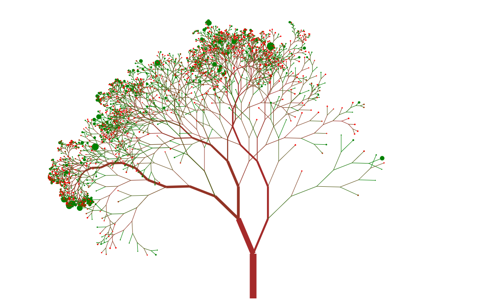

# Random Forest Visualization

## Setup
As prerequisites you need node.js v10 or newer and the project dependencies installed (run `npm install`).

## GUI
To analyse a random forest in th web GUI run `npm run gui` and open your browser at `http://localhost:3000`.

For development it is recommended to open two terminal processes, one running `npm run server` and the other one `npm run watch:js`.
This way you have separated logs for front and backend and the frontend bundle is automatically rebuild on file changes.

## CLI
Experimental: To generate PNGs from your data run `npm run cli`