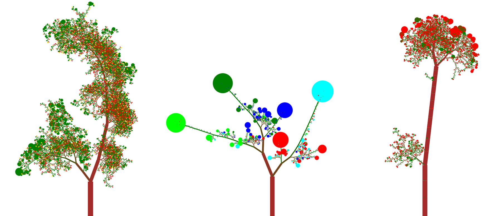
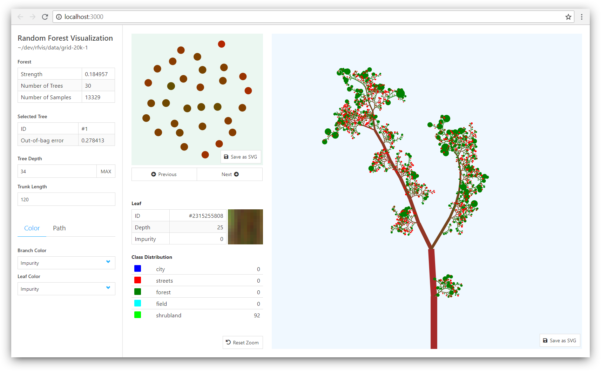

# RFVis [](https://pypi.org/project/rfvis/) [](https://pypi.org/project/rfvis/) [](https://pypi.org/project/rfvis/)

A tool for visualizing the structure and performance of Random Forests (and other ensemble methods based on decision trees).



RFVis offers a [Command Line API](#command-line-api) and a [Python API](#python-api) which works on a [sklearn.ensemble.RandomForestClassifier](https://scikit-learn.org/stable/modules/generated/sklearn.ensemble.RandomForestClassifier.html).


## Getting Started 

Install and update RFVis via [pip](https://pip.pypa.io/en/stable/quickstart/):

```
$ pip install rfvis
```

This will allow you interactively visualize a fitted Random Forest (RF) in your
browser. To directly generate SVG files from your model you also need to install
[Node.js](https://nodejs.org/en/download/), see [Command Line Interface](#command-line-interface) for more information.


## Command Line API

RFVis offers a command line tool to either generate SVG files directly from
your input data (`rfvis cli <data>`) or to spin up a web-based GUI for a more
interactive analysis (`rfvis gui <data>`).

To see all available commands run:
```
$ rfvis --help
Usage: rfvis [OPTIONS] COMMAND [ARGS]...

  A tool for visualizing the structure and performance of Random Forests

Options:
  --version  Show the version and exit.
  --help     Show this message and exit.

Commands:
  cli  Command line interface to generate SVGs.
  gui  Web-based graphical user interface.
```


### Graphical User Interface

To interactively analyze your forest with the web-based GUI run:
```
$ rfvis gui /path/to/data
 * Running on http://127.0.0.1:8080/ (Press CTRL+C to quit)
```
You can now open up your browser at <http://localhost:8080> to see something like this:




### Command Line Interface

To use the Command Line Interface (CLI) you need to have
[Node.js](https://nodejs.org/en/download/) v8+ installed on your system. This
is a technical limitation due to the fact that the rendering is written in
Javascript. You do not need to install any other package though, the CLI
integrates into the command line tool you already installed via pip:
```
$ rfvis cli /path/to/data
>> Exported "/dev/random-forest-visualization/tree-0.svg"
>> Exported "/dev/random-forest-visualization/tree-1.svg"
>> Exported "/dev/random-forest-visualization/tree-2.svg"
>> Exported "/dev/random-forest-visualization/tree-3.svg"
...
```

Get a full list of available options with `--help`:
```
$ rfvis cli --help
Usage: rfvis cli [OPTIONS] FOREST_JSON

  Web-based graphical user interface.

  As Python is unable to render React components, we make a subprocess call to a small
  Node.js application which will do the rendering and also store the created SVG
  files. This command requires that Node.js is installed on your system!

  FOREST_JSON: Path to the JSON file that contains the forest's data.

Options:
  -o, --out PATH                  Output path of the SVG files.  [default: (current
                                  working directory)]
  -w, --width INTEGER             Width of the SVG.  [default: 800]
  -h, --height INTEGER            Height of the SVG.  [default: 800]
  --trunk-length INTEGER          Length of the trunk which influences the overall tree
                                  size.  [default: 100]
  --display-depth INTEGER         Maximum depth of the tree rendering. Cut of leaves are
                                  visualized as pie chart consolidation nodes.
  --branch-color [Impurity]       Coloring of the branches.  [default: Impurity]
  --leaf-color [Impurity|Best Class]
                                  Coloring of the leaves.  [default: Impurity]
  --help                          Show this message and exit.
```


### Input Data

The data for the Command Line API must be available on your filesystem as a JSON file
for the forest and additionally one CSV file per tree. Both data formats will
be extended with properties in the future, this is just the minimal set.

You can find a working example under `examples/PolSAR`.


#### Forest JSON

The main `forest.json` holds all information about the ensemble model:

- **name** (string): Name of your forest, will be displayed in the GUI
- **error** (float): The error (e.g. the out-of-bag or validation error) of the 
    entire ensemble model, will be displayed in the GUI
- **n_samples** (int): Number of samples the model was trained on
- **correlationMatrix** (float[][]): Correlation between the single trees within
    the model. Has dimensions `NxN` where `N` is the number of trees.
    This will be used to compute the forest map. 
- **classes**: The output classes
    - **name** (string): Name of the class
    - **color** (int, int, int): RGB values in the range of 0-255 which
        determine the color of the class in the visualization
- **trees**: The trees in the forest
    - **error** (float): The error (again could be either the out-of-bag or
        validation error) of the single tree
    - **data** (string): Relative path to the CSV file containing the tree data


#### Tree CSV

For each tree specified in the `forest.json` RFVis expects a CSV file where one
entry represents one node in the tree. An entry has the following format:

- **id** (int): ID of the node
- **depth** (int) Depth of the node in the tree (starting at `0`)
- **n_node_samples** (int): Number of training samples reaching the node
- **impurity** (float): Impurity of the node (`0`-`1`)
- **value** (int[]): Class distribution within the node, i.e. every entry 
    represents the amount of samples within the node that respond to a specific 
    class. The index corresponds to the indices in `forest.classes`.


## Python API

RFVis also offers a Python API which works directly on a scikit-learn RandomForestClassifier.
You can find a working example under `examples/scikit_learn.py`.

The function `rfvis.gui()` visualizes a fitted RandomForestClassifier in a web based graphical user interface.
The server runs in a separate process and is available at `http://localhost:<port>`.

```python
gui(model, data=None, target=None, name=None, class_names=None, class_colors=None, port=8080)
```

Args:

- **model** ([sklearn.ensemble.RandomForestClassifier](https://scikit-learn.org/stable/modules/generated/sklearn.ensemble.RandomForestClassifier.html)):
    The model to visualize.
- **data** (array-like, shape=(n_samples, n_features)): The training input samples that were used to fit the model.
    Used to compute the out-of-bag error and correlation of the individual trees.
    If not provided, the forest view will have no significance.
- **target** (array-like, shape=n_samples): The target values (class labels) that were used to fit the model.
    Used to compute the out-of-bag error and correlation of the individual trees.
    If not provided, the forest view will have no significance.
- **name** (str): Optional name of the model which will be displayed in the frontend.
- **class_names** (List[str]): Optional list of names of the target classes
- **class_colors** (List[str]): Optional list of browser interpretable colors for the target classes.
    See https://developer.mozilla.org/en-US/docs/Web/CSS/color_value.
- **port** (int): Port on which the frontend will run on. Defaults to 8080.

Returns:
- **process** (multiprocessing.Process): Subprocess that runs the server. Can be terminated with
    [process.terminate()](https://docs.python.org/3/library/multiprocessing.html#multiprocessing.Process.terminate).

## Development

The repository contains a `Pipfile` for conveniently creating a virtualenv
for development. Just install [pipenv](https://pipenv.readthedocs.io/en/latest/)
and run:

```
$ pipenv install
```

You can now e.g. start the server on the default port 8080 via:

```
$ pipenv run rfvis gui <path_to_forest_json>
```

Note that you need to build the frontend bundle first before you can
actually see the application working on `http://localhost:8080`.

To build the frontend you need Node.js installed. First install all 
dev-dependencies by running the following 
from within the `./rfvis/client` directory:

```
$ npm install
```

Now you can build a production-ready bundle via:

```
$ npm run build
```

If you have the Python server running you should now be able to see the
application at `http://localhost:8080`.

For developing on the frontend more conveniently run:

```
$ npm start
```

To start a development server with hot reloading at `http://localhost:3000`.


## Publications

If you are using RFVis in your research, please cite the following paper:
- Ronny Hänsch, Philipp Wiesner, Sophie Wendler, and Olaf Hellwich. "[Colorful Trees: Visualizing Random Forests for Analysis and Interpretation](https://ieeexplore.ieee.org/abstract/document/8658566)" In 2019 *IEEE Winter Conference on Applications of Computer Vision (WACV)*, pp. 294-302. IEEE, 2019.
